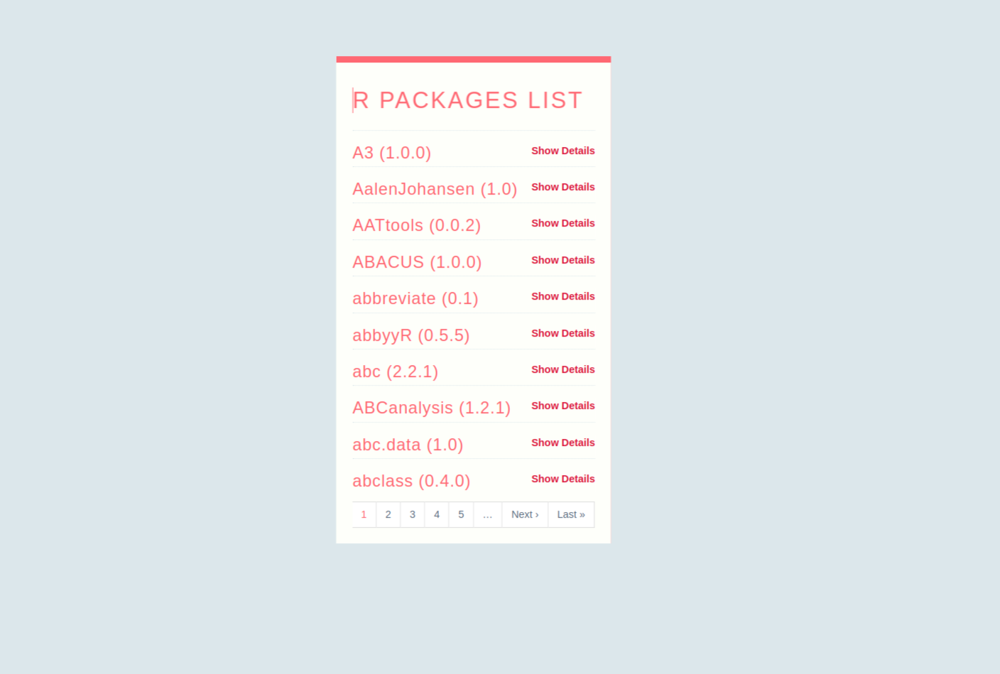
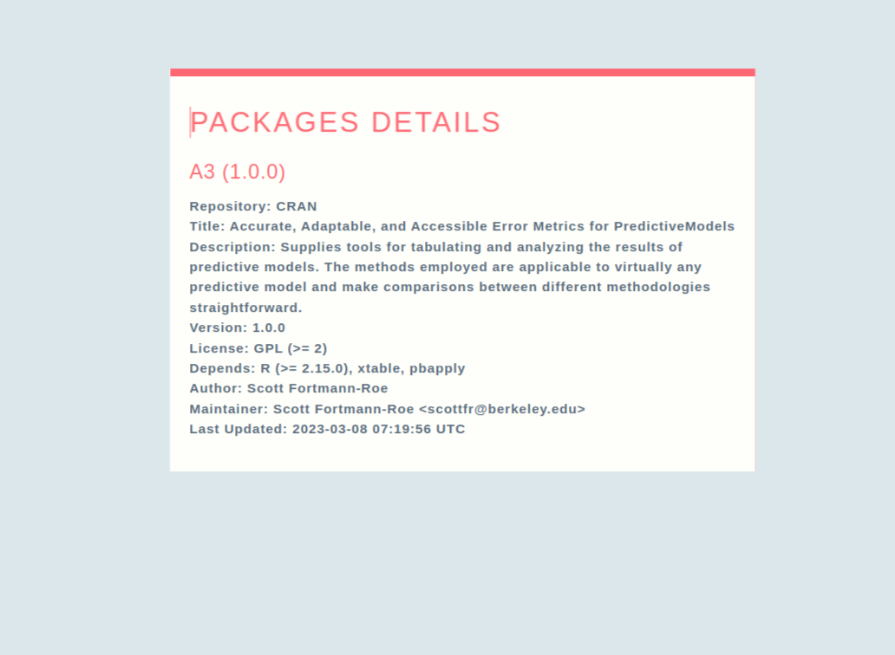

# Latana Project

## Prerequisite

1. Ruby version - 3.2.1
2. Rails version - 7.0.4.2
3. Node.js version - v14.16.0
4. Postgresql - 15.2
  
## Project setup

1. Clone the project by doing `git clone https://github.com/SanketKarve/latana.git`
2. Move to project by `cd latana`
3. Install the package `bundle install`
4. Add .env file with the postgres database details
```
DATABASE_HOST=localhost
DATABASE_USERNAME=<db_username>
DATABASE_PASSWORD=<db_password>
```
5. Setup the database by `rails db:setup` this will create database, run migration and load seed file.
6. Run the `whenever --update-crontab` command to setup the cron job
7. To check if the cron is set up you can run `crontab -l`
8. Run `whenever --clear-crontab` if you want to clear the cron job
9. Start the rails server by using command `rails s`. The server will start at `http://localhost:3000`

## Screenshots

*Package list*



*Package details*




## Approach

There are 2 ways get the package list and details

1. Using threads and process
   1. Load the packages list and use thread and process to get the package details and populate the database
   2. Pros:
      1. We have all the package updated details
   3. Cons:
      1. The method is process heavy and usage of process and thread depends on the system configuration.
      2. There is limit of the thread pool on how much you can spwan it so a Queue is required to main the thread.
2. On demand fetch the package details
   1. First we load all the packages from the CRAN Package index(meta data) and store in the database
   2. When user click on the show details CTA, we fetch the package details and so we load only package which user want.
   3. Pros:
      1. This method is on demand and does not use more process of machine
   4. Cons: 
      1. Only visited package has the more details

The scheduling is set for daily check of the packages based on the version.
It also check the database if there package exist or not else it will make new record.

